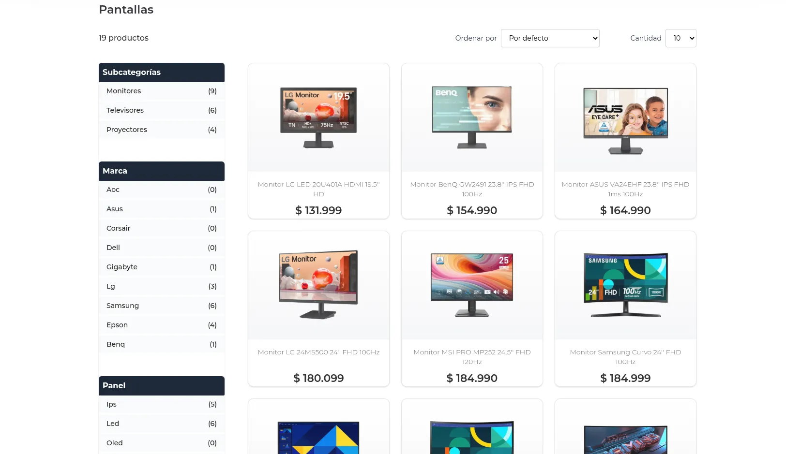
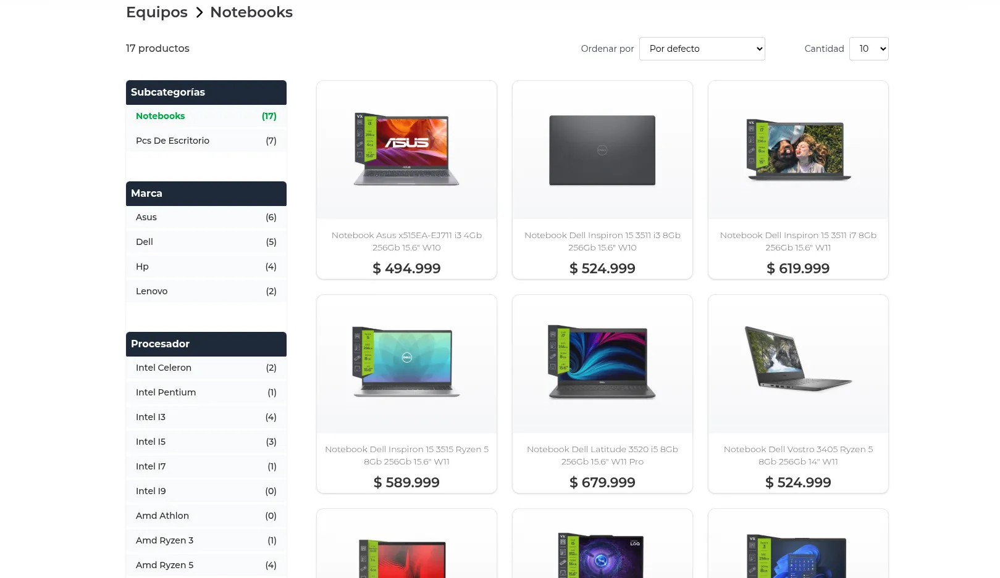
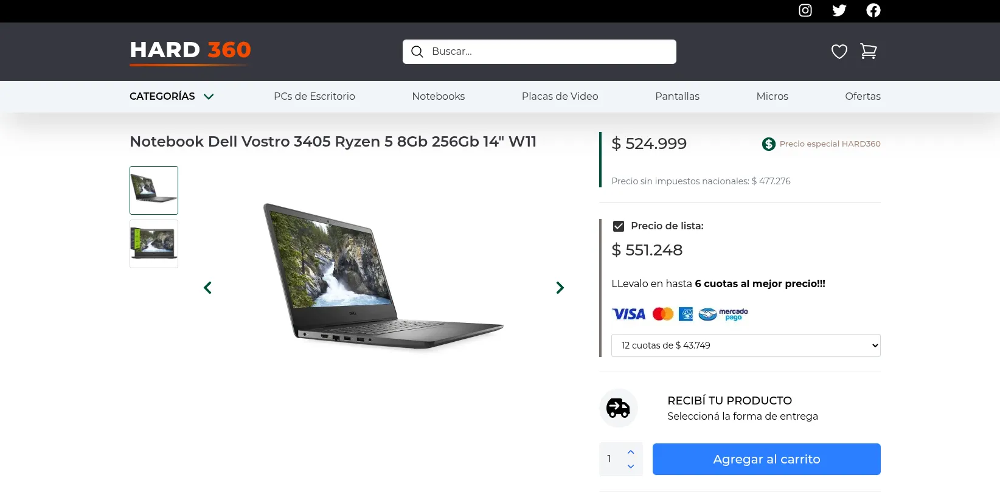
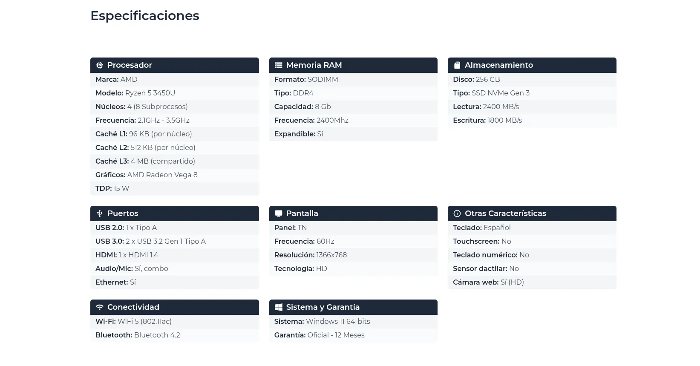
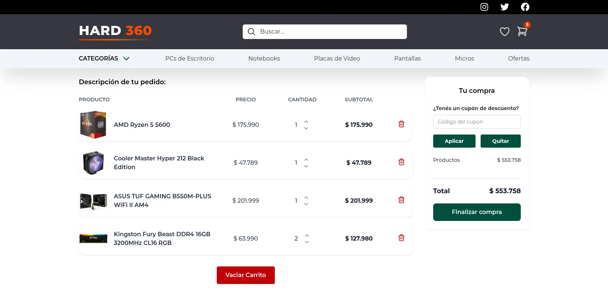

# Hard360 - Ecommerce Tecnológico

**Hard360** es un ecommerce de productos tecnológicos desarrollado como parte de mi portfolio frontend. Este proyecto refleja mi evolución como desarrollador, incorporando buenas prácticas, una estructura escalable y un fuerte enfoque en la experiencia de usuario.


## ✨ Características Principales

- Desarrollado con **Next.js** y **TypeScript**.
- **Renderizado del lado del servidor (SSR)** para mejorar el rendimiento y el SEO.
- **Estructura de carpetas modular** basada en categorías de productos.
- **Datos simulados** mediante archivos `.ts`, evitando servicios externos para mayor control y estabilidad.
- **Tipado estricto** de cada producto (por ejemplo: `NotebookSpecs`, `TvSpecs`, `RamSpecs`, etc.).
- **Filtros dinámicos** por categoría y subcategoría.
- **Lógica de filtros desacoplada** en un *custom hook* centralizado.
- **Estado global del carrito** manejado con **Context API**.
- **Precios almacenados en centavos como `string`** y formateados dinámicamente a pesos argentinos.

---

## 🗂️ Estructura de Datos

Toda la información de productos está centralizada en un único archivo: `app/data/data.ts`. Este archivo exporta una constante `products`, que es un array de objetos tipados como `Product`.

El tipo `Product` define propiedades comunes a todos los productos (`id`, `title`, `price`, `category`, `subcategory`, etc.) y contempla otras opcionales que dependen de su categoría o subcategoría.

La propiedad `specs` es clave y está fuertemente tipada. Su estructura varía según el tipo de producto. Por ejemplo:

- En `almacenamiento > hdd`, `specs` puede incluir: `velocidadRotacion`, `ruido`.
- En `almacenamiento > ssd`, cambia por: `tipo`, `capacidad`, `TBW (Total Bytes Written)`, `MTBF (Mean Time Between Failures)`.

Esto permite adaptar las especificaciones técnicas a cada tipo de producto, manteniendo una estructura general coherente y escalable.

Los precios están definidos como `string` en centavos (`"7500000"`) y se formatean dinámicamente en el *frontend* a pesos argentinos mediante una función utilitaria.

### 🧾 Ejemplo de Producto

```ts
{
  id: "almacenamiento-ssd-1",
  title: "Disco SSD Hiksemi 120GB SATA III",
  slug: "ssd-hiksemi-120gb-sata3",
  thumbnail: "/products/almacenamiento/ssd/hiksemi-sata3-120gb/hiksemi-sata3-120gb_1.webp",
  images: [
    "/products/almacenamiento/ssd/hiksemi-sata3-120gb/hiksemi-sata3-120gb_1.webp",
  ],
  price: "12799",
  category: "almacenamiento",
  subcategory: "ssd",
  brand: "hiksemi",
  storageSize: "120gb",
  specs: {
    tipo: "SATA",
    capacidad: "120 GB",
    formato: '2.5"',
    interfaz: "SATA III",
    velocidadLectura: "520 MB/s",
    velocidadEscritura: "430 MB/s",
    cache: "No",
    tbw: "60 TBW",
    mtbf: "1 millón de horas",
    consumo: "2.0W",
  },
}
```

---

## 🚀 Ejecutar el proyecto localmente

Para configurar y ejecutar el proyecto en tu máquina local:

1. Cloná el repositorio:

```bash
git clone https://github.com/eduviana/hard360
```

2. Instalá las dependencias:

```bash
npm install
# o
yarn install
```

3. Iniciá el servidor de desarrollo:

```bash
npm run dev
# o
yarn dev
```

4. Abrí tu navegador en [http://localhost:3000](http://localhost:3000)

---

## 🧱 Organización del Código

El proyecto está estructurado de manera clara y modular:

- `app/` → Rutas y SSR (Server-Side Rendering)
- `app/data/` → Datos simulados (productos)
- `components/` → Componentes reutilizables
- `hooks/` → Lógica de filtros (custom hook)
- `contexts/` → Estado global del carrito
- `lib/` → Utilidades (helpers, formateo de precios, etc.)

---

## ⚙️ Notas Técnicas Destacadas

- Se utiliza una ruta dinámica en `app/[...slug]/page.tsx` que interpreta el array `slug` para renderizar categorías, subcategorías o productos individuales.
- La lógica de filtrado está completamente desacoplada y centralizada en un *custom hook*, lo que facilita el mantenimiento y mejora la legibilidad del código.
- Todo el sistema de datos está fuertemente tipado. Se definen entidades como `notebookBrands`, `tvBrands`, `ramCapacities`, `ramVersion`, etc., garantizando consistencia en los datos.
- El manejo de precios en centavos (como string) y su conversión dinámica fue una técnica recomendada en una tutoría profesional.

---

## 📸 Capturas de Pantalla

### Hero  


### Sección de la home  


### Página de categorias  


### Filtro Subcategoría activo  


### Detalle de un producto  


### Especificaciones de un producto


### Carrito de compras  


---

## 🧠 Aprendizajes Clave

Durante el desarrollo de este proyecto:

- Mejoré el desacoplamiento entre lógica de negocio y presentación.
- Consolidé el uso estricto de TypeScript para modelar datos con precisión.
- Incorporé buenas prácticas de SSR y estructura modular en Next.js.
- Implementé el manejo de precios en centavos para evitar errores de redondeo.
- Priorizo estabilidad y control evitando servicios externos, al tratarse de un proyecto de portfolio.

---

## 🔗 Link al Sitio

https://hard360.vercel.app/

---

## 👤 Autor

Desarrollado por **Eduardo Viana**